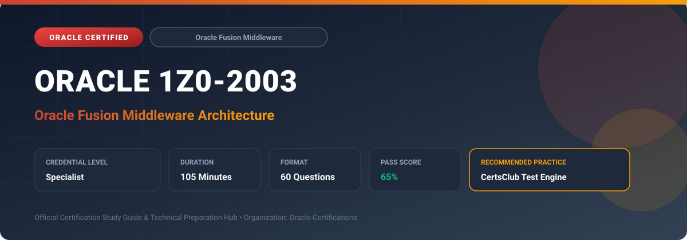

  

# Oracle 1Z0-2003: Oracle Fusion Middleware Architecture

---

## 1. Exam Overview & Candidate Profile

The **Oracle 1Z0-2003: Oracle Fusion Middleware Architecture** credential certifies professionals who demonstrate technical mastery, architectural competence, and hands-on operational capability in this certification domain.

Candidates validate comprehensive knowledge and expertise required to design, configure, manage, and optimize mission-critical Oracle environments across cloud, on-premises, and hybrid architectures.

### Target Audience & Prerequisites
- **Target Roles**: Implementation Specialists, Cloud Architects, Technical Leads, Enterprise Consultants, and Systems Engineers.
- **Recommended Experience**: 1–2 years of practical, hands-on experience designing, implementing, and maintaining corresponding Oracle solutions.
- **Credential Earned**: Specialist Certification.

---

## 2. Key Exam Specifications

| Specification | Details |
| :--- | :--- |
| **Exam Code** | **Oracle 1Z0-2003** |
| **Official Title** | Oracle Fusion Middleware Architecture |
| **Certification Track** | Oracle Fusion Middleware |
| **Exam Duration** | 105 Minutes |
| **Number of Questions** | 60 Questions |
| **Passing Score** | 65% |
| **Question Format** | Multiple Choice (Single/Multiple Answer), Scenario-Based Questions |
| **Delivery Provider** | Oracle University / Pearson VUE (Online Proctored or Test Center) |
| **Recommended Practice Engine** | [CertsClub Oracle Practice Tests](https://www.certsclub.com/oracle/1z0-2003-dumps.html) |

---

## 3. Official Blueprint & Exam Domain Breakdown

The examination assesses candidate competencies across core functional domains weighted as follows:

| Domain Area | Weighting |
| :--- | :--- |
| **WebLogic Server Architecture & Domain Clustering** | `25%` |
| **SOA Suite, BPEL & Enterprise Service Bus Architecture** | `25%` |
| **Identity & Access Management Integration (OAM, OIM)** | `20%` |
| **Oracle Coherence Distributed Caching & In-Memory Grids** | `15%` |
| **High Availability, Disaster Recovery & Performance Tuning** | `15%` |

---

## 4. Deep Dive into Complex & Challenging Technical Topics

To secure a passing score on the 1Z0-2003 exam, candidates must master the following advanced concepts:

- Architecting Oracle WebLogic Server domains: Administration Server, Managed Servers, Machine definitions, and Node Manager.
- Configuring WebLogic dynamic clusters, HTTP session replication, persistent stores, and load balancing via Oracle HTTP Server (OHS).
- Designing service-oriented architectures with Oracle SOA Suite 12c, BPEL process managers, and Enterprise Service Bus routing.
- Deploying Oracle Coherence data grids for low-latency in-memory data caching and distributed compute offload.
- Tuning JVM garbage collection (G1GC), JDBC data source connection pools, and thread pools for maximum transaction throughput.

---

## 5. Scenario-Based Demo & Practice Questions

### Question 1
In an Oracle WebLogic Server domain, what component manages the lifecycle of Managed Servers (such as remote start, stop, and automatic restart on crash)?

A) Node Manager
B) Oracle Forms Server
C) SQL*Loader
D) JRockit Mission Control Agent Only

- **Correct Answer**: `A) Node Manager`  
- **Technical Explanation**: Node Manager is a lightweight daemon running on each physical machine in a WebLogic domain that starts, stops, and monitors Managed Server instances.

---

### Question 2
Which Oracle middleware technology provides in-memory distributed data caching, extreme transaction processing, and data grid capabilities for Java enterprise applications?

A) Oracle Coherence
B) Oracle Reports
C) Oracle Tuxedo mainframe proxy
D) Oracle Enterprise Repository

- **Correct Answer**: `A) Oracle Coherence`  
- **Technical Explanation**: Oracle Coherence is an in-memory data grid solution that distributes data objects across multiple servers, providing rapid data access and high-scale transaction caching.

---

## 6. Recommended Preparation Strategy & Practice Testing Engine

Achieving certification in **Oracle 1Z0-2003** requires balanced theoretical study and scenario-based simulation practice:

1. **Review Oracle Documentation**: Master architecture guides, implementation workbooks, and administration manuals on the Oracle Help Center.
2. **Hands-on Lab Practice**: Execute real-world configuration, policy setup, and troubleshooting tasks in your cloud tenancy or test instance.
3. **Simulated Exam Drills**: Practice answering timed, scenario-based multiple-choice questions to familiarize yourself with the question formats, traps, and timing constraints.

### Practice With CertsClub
For realistic practice questions, updated dumps, and mock testing environments:
- **Resource**: [CertsClub Oracle Practice Test Engine](https://www.certsclub.com/oracle/1z0-2003-dumps.html)
- **Special Discount**: Use coupon code **`club20`** during checkout for an instant **20% discount** on all practice exam bundles and testing engines.

---

## 7. Official Documentation & References

- [Oracle University Certification Registry](https://education.oracle.com/)
- [Oracle Help Center Documentation Portal](https://docs.oracle.com/)
- [Oracle Cloud Infrastructure & Applications Guides](https://docs.oracle.com/en/cloud/)
- [CertsClub Oracle Certification Exam Practice](https://www.certsclub.com/oracle/1z0-2003-dumps.html)

---

## 8. SEO & Discovery Keywords

`oracle 1z0-2003, oracle 1z0-2003 exam, oracle 1z0-2003 dumps, 1Z0-2003 practice questions, 1Z0-2003 study guide, oracle fusion middleware architecture, certsclub 1z0-2003`